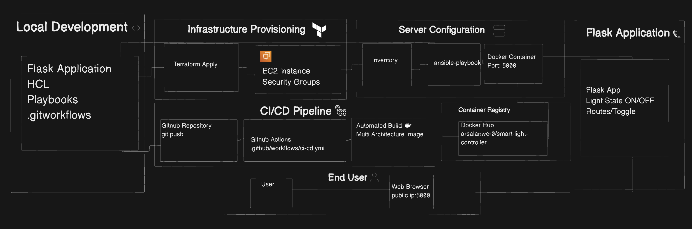

# Smart Light Controller

A full-stack DevOps demonstration project that showcases modern cloud deployment practices through a simple Flask web application. This project implements a complete Infrastructure as Code (IaC) pipeline using Docker, Terraform, Ansible, and GitHub Actions.

## Overview

The Smart Light Controller allows users to toggle a virtual light on/off through a web interface. While the application logic is intentionally simple, the project demonstrates enterprise-level DevOps practices including containerization, infrastructure automation, configuration management, and CI/CD pipelines.

## Architecture and Workflow

```

```

## Project Structure

```
smart-light-controller/
├──  Dockerfile                    # Container definition
├──  Flask Application
│   ├── app/
│   │   ├── __init__.py              # Flask app factory
│   │   └── main.py                  # Routes and logic
│   ├── static/style.css             # Frontend styling
│   ├── templates/index.html         # Web interface
│   └── requirements.txt             # Python dependencies
├──  Infrastructure as Code
│   ├── terraform/main.tf            # AWS infrastructure
│   └── ansible/playbook.yml        # Server configuration
├──  CI/CD Pipeline
│   └── .github/workflows/ci-cd.yml  # GitHub Actions
└──  Configuration
    ├── .gitignore                   # Git exclusions
    ├── .dockerignore               # Docker exclusions
    └── README.md                   # Documentation
```

## Technology Stack

- **Flask**: Lightweight Python web framework
- **Docker**: Application containerization
- **Terraform**: Infrastructure provisioning (AWS EC2, Security Groups)
- **Ansible**: Configuration management and deployment
- **GitHub Actions**: CI/CD automation
- **AWS**: Cloud infrastructure (EC2, VPC)

## Quick Start

### Local Development

```bash
# Clone and setup
git clone https://github.com/ArsalanAnwer0/smart-light-controller.git
cd smart-light-controller

# Create virtual environment
python3 -m venv venv
source venv/bin/activate  # macOS/Linux
# venv\Scripts\activate   # Windows

# Install and run
pip install -r requirements.txt
flask --app app:create_app run

# Access at http://127.0.0.1:5000
```

### Docker Development

```bash
# Build and run container
docker build -t smart-light-controller .
docker run -p 5000:5000 smart-light-controller

# Access at http://127.0.0.1:5000
```

## AWS Deployment

### Prerequisites

- AWS account with programmatic access
- AWS CLI configured (`aws configure`)
- Terraform installed
- Ansible installed
- Docker Hub account
- EC2 Key Pair created

### Deployment Steps

#### 1. Build and Push Container

```bash
# Build multi-architecture image
docker buildx build --platform linux/amd64,linux/arm64 \
  -t your-dockerhub-username/smart-light-controller:latest --push .
```

#### 2. Provision Infrastructure

```bash
cd terraform
terraform init
terraform apply -var="key_name=your-ec2-keypair"
# Note the public IP from output
```

#### 3. Configure and Deploy

```bash
# Create inventory file
echo "[ec2]" > inventory.ini
echo "YOUR_EC2_PUBLIC_IP ansible_user=ubuntu ansible_ssh_private_key_file=path/to/your-key.pem" >> inventory.ini

# Deploy application
ansible-playbook -i inventory.ini ansible/playbook.yml

# Access at http://YOUR_EC2_PUBLIC_IP:5000
```

#### 4. Cleanup

```bash
terraform destroy  # Removes all AWS resources
```

## CI/CD Pipeline

### Automated Workflows

**On Push to Main:**
- Builds and pushes Docker image to Docker Hub
- Runs basic validation tests

**Manual Deployment:**
- Provisions AWS infrastructure via Terraform
- Deploys application via Ansible

### Required GitHub Secrets

Configure these in your repository settings:

```
DOCKER_USERNAME          # Docker Hub username
DOCKER_PASSWORD          # Docker Hub password  
AWS_ACCESS_KEY_ID        # AWS access key
AWS_SECRET_ACCESS_KEY    # AWS secret key
AWS_KEY_NAME            # EC2 key pair name
```

## Security Considerations

### Current Configuration
- Security group allows HTTP traffic from anywhere (0.0.0.0/0)
- SSH access restricted to key-based authentication
- Application runs as non-root user in container

### Production Recommendations
- Restrict security group to specific IP ranges
- Implement HTTPS with SSL certificates
- Use AWS IAM roles instead of access keys
- Enable CloudWatch logging and monitoring
- Implement proper secret management

## Application Features

- **Light State Management**: Toggle virtual light on/off
- **Real-time Updates**: Dynamic page updates without refresh
- **Responsive Design**: Works on desktop and mobile
- **Container Health**: Automatic restart on failure

## Technical Implementation

### Flask Application
- RESTful API design with GET/POST endpoints
- In-memory state storage (resets on restart)
- Template-based HTML rendering
- JSON API responses

### Docker Configuration
- Multi-stage build for optimization
- Non-root user for security
- Health check endpoint
- Minimal Python slim base image

### Infrastructure
- AWS EC2 t2.micro instance
- Custom VPC with public subnet
- Security groups with minimal required access
- Automated key pair management

## Development Workflow

```bash
# 1. Make changes locally
git checkout -b feature-branch
# ... make changes ...

# 2. Test locally
docker build -t test-image .
docker run -p 5000:5000 test-image

# 3. Deploy to development
git push origin feature-branch
# GitHub Actions builds and pushes image

# 4. Deploy to AWS
terraform apply
ansible-playbook -i inventory.ini ansible/playbook.yml

# 5. Cleanup
terraform destroy
```

## Troubleshooting

### Common Issues

**"No matching manifest for linux/amd64"**
```bash
# Rebuild with correct architecture
docker buildx build --platform linux/amd64 -t your-image --push .
```

**Ansible connection failed**
```bash
# Check security group allows SSH (port 22)
# Verify key file permissions: chmod 400 your-key.pem
```

**Application not accessible**
```bash
# Check security group allows port 5000
# Verify container is running: docker ps
```

## Contributing

1. Fork the repository
2. Create a feature branch
3. Make your changes
4. Test locally and with Docker
5. Submit a pull request

## Learning Outcomes

This project demonstrates:
- Infrastructure as Code principles
- Container orchestration
- Configuration management
- CI/CD pipeline design
- Cloud security basics
- DevOps tool integration

## License

MIT License - see [LICENSE](LICENSE) file for details.

## Acknowledgments

Built as a learning project to demonstrate modern DevOps practices and cloud deployment strategies.